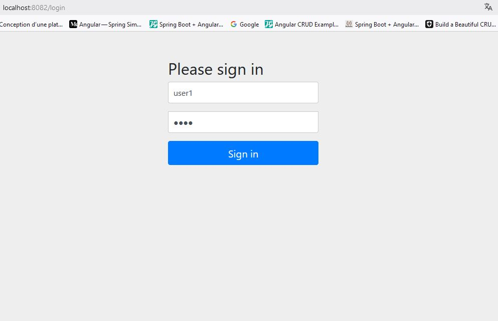

<h1>Compte Rendu</h1>

L'application spring boot de gestion des patients en appliquant la notiton de 
CRUD (Create - Read - Update - Delete)
Les packages : - entitites - repositories - web - security.

<h3>1. Dossiers du Projet</h3>

<h3>2. Liste des patients</h3>

<h3>3. Création d'un patient</h3>

<h3>4. Modifier un patient</h3>

<h3>5. Supprimer un patient</h3>

<h3>6. Chercher un patient</h3>

<h3>7. Connexion avec spring security</h3>
